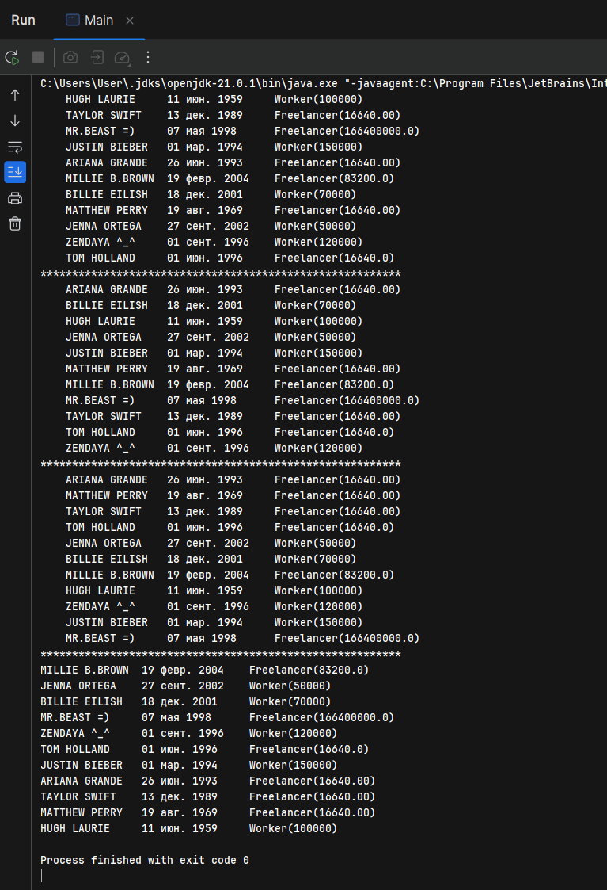

### Employer
[Employer.java](src%2Fmain%2Fjava%2Forg%2Fgr40in%2Fmodel%2FEmployer.java)
```java
/**
 *  in default compare by name
 */
public abstract class Employer implements Comparable<Employer> {
    private String name;
    private LocalDate birthDate;
    private DateTimeFormatter formatter = DateTimeFormatter.ofPattern("dd MMM yyyy");

    public abstract BigDecimal getMonthlySalary();

    public Employer(String name, LocalDate birthDate) {
        this.name = name;
        this.birthDate = birthDate;
    }

    @Override
    public int compareTo(Employer o) {
        return this.name.compareTo(o.name);
    }

    //region equals & hashcode
    @Override
    public boolean equals(Object o) {
        if (this == o) return true;
        if (o == null || getClass() != o.getClass()) return false;
        Employer employer = (Employer) o;
        return Objects.equals(name, employer.name) && Objects.equals(birthDate, employer.birthDate);
    }

    @Override
    public int hashCode() {
        return Objects.hash(name, birthDate);
    }
    //endregion

    //region getters/setters
    public String getName() {
        return name;
    }

    public void setName(String name) {
        this.name = name;
    }

    public LocalDate getBirthDate() {
        return birthDate;
    }

    public void setBirthDate(LocalDate birthDate) {
        this.birthDate = birthDate;
    }

    @Override
    public String toString() {
        return  name + " \t" + birthDate.format(formatter);
    }

    //endregion
}

```

### Freelancer
[Freelancer.java](src%2Fmain%2Fjava%2Forg%2Fgr40in%2Fmodel%2FFreelancer.java)
```java
public class Freelancer extends Employer {
    private BigDecimal hourlyRate;

    @Override
    public BigDecimal getMonthlySalary() {
        return hourlyRate.multiply(EmployerService.getWorkHoursOfTheMonth());
    }

    public Freelancer(String name, LocalDate birthDate, BigDecimal hourlyRate) {
        this(name, birthDate);
        this.hourlyRate = hourlyRate == null ? EmployerService.getMinHourlyRate() : hourlyRate;
    }

    public Freelancer(String name, LocalDate birthDate) {
        super(name, birthDate);
        if (this.hourlyRate == null) this.hourlyRate = EmployerService.getMinHourlyRate();
    }

    @Override
    public String toString() {
        return super.toString() + " \t Freelancer(" + getMonthlySalary() + ")";
    }
}
```

### EmployerSalaryComparator
[EmployerSalaryComparator.java](src%2Fmain%2Fjava%2Forg%2Fgr40in%2Fmodel%2FEmployerSalaryComparator.java)
```java
public class EmployerSalaryComparator implements Comparator<Employer> {
    @Override
    public int compare(Employer o1, Employer o2) {
        return o1.getMonthlySalary().subtract(o2.getMonthlySalary()).intValue();
    }
}
```

### Staff 
[Staff.java](src%2Fmain%2Fjava%2Forg%2Fgr40in%2Fmodel%2FStaff.java)
```java
public class Staff implements Iterable<Employer> {
    private List<Employer> staffList;

    public Staff(List<Employer> staffList) {
        this.staffList = staffList;
    }

    public Staff(Employer[] employersArray) {
        this(Arrays.asList(employersArray));
    }


    public List<Employer> getStaffList() {
        return staffList;
    }

    public void setStaffList(List<Employer> staffList) {
        this.staffList = staffList;
    }

    @Override
    public Iterator<Employer> iterator() {
        return new employerIterator();
    }

    public class employerIterator implements Iterator<Employer> {
        int current;

        @Override
        public boolean hasNext() {
            return current != staffList.size();
        }

        @Override
        public Employer next() {
            return staffList.get(current++);
        }
    }
}
```

So, what can i say - that it works

